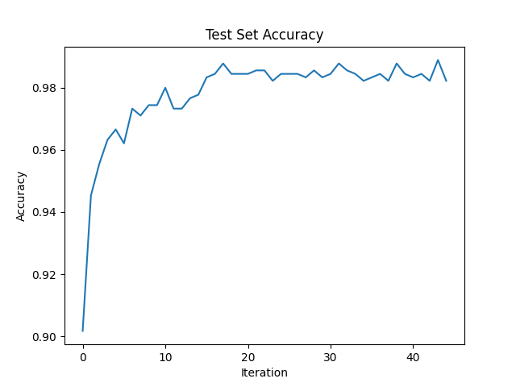
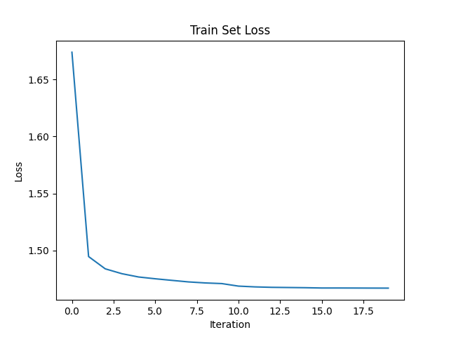
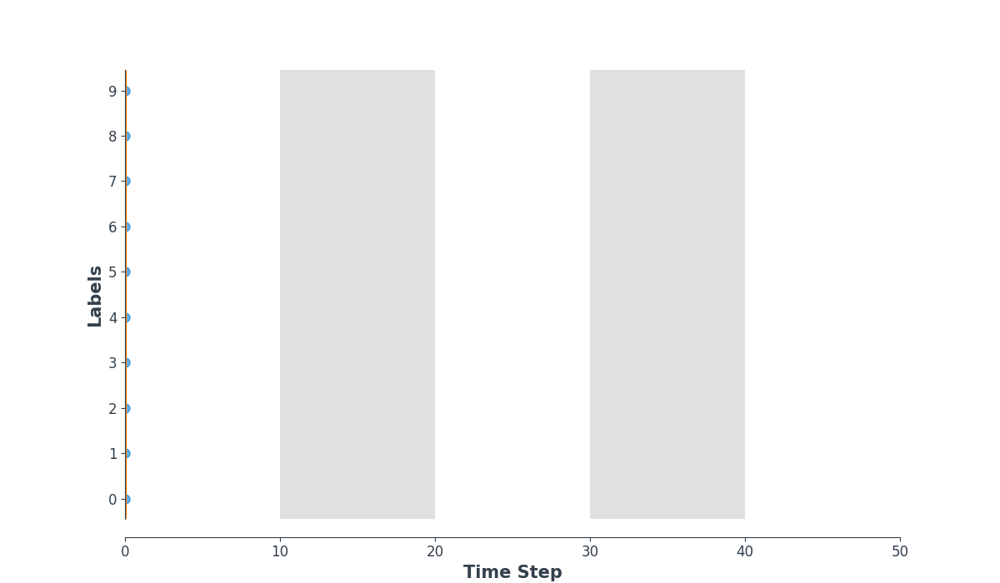

# SNN Image Classification

Homework 2 of AI3610.

## Installation

```bash
# 1. Create a conda virtual enviornment.
conda create -n snn python=3.9 -y
conda activate snn

# 2. Install PyTorch >= 1.10 according to your CUDA version. For example:
pip3 install torch torchvision torchaudio --extra-index-url https://download.pytorch.org/whl/cu113

# 3. Install the library
pip install -e .
```

## Model

In this library, I implement a simple convolutional spiking neural network (CSNN) . The convolutional network architecture to be used is: 12C5-MP2-64C5-MP2-1024FC10.

- 12C5 is a 5×5 convolutional kernel with 12 filters
- MP2 is a 2×2 max-pooling function
- 1024FC10 is a fully-connected layer that maps 1,024 neurons to 10 outputs

The detailed implementation can be found [here](snn_nmnist/utils.py). (See the `build_model` function)

## Quick Start

The system is implemented with [hydra](https://hydra.cc/docs/intro/). The configuration can be easily figured out in cmd. I highly recommend users to run the script on a GPU.

```bash
# To specify a gpu id:
CUDA_VISIBLE_DEVICES=0 python scripts/train.py

# To customize configuration settings:
CUDA_VISIBLE_DEVICES=0 python scripts/train.py exp_id=subset1_epochs100 data.subset=1 train.num_epochs=100
```

All flags can be found [here](configs/default.yaml).

## Results

The results and logs can be found in `exp/{exp_id}/` after running my script, which contains the checkpoints, logs and some visualization results.

For default setting, I achieve a final test accuracy of  **98.21%**. The log file can be found [here](docs/training.log).

Training loss curve and testing accuracy curve are shown as below:

 



Some spike counter examples:

- **Target: 2**

  

- **Target: 9**

  

- **Target: 4**

  

- **Target: 4**

  

- **Target: 7**

  

## Acknowledgement

I would like to thank the awesome [snnTorch](https://github.com/jeshraghian/snntorch) that I have referred to.

## References

```bibtex
@article{eshraghian2021training,
        title   =  {Training spiking neural networks using lessons from deep learning},
        author  =  {Eshraghian, Jason K and Ward, Max and Neftci, Emre and Wang, Xinxin
                    and Lenz, Gregor and Dwivedi, Girish and Bennamoun, Mohammed and
                   Jeong, Doo Seok and Lu, Wei D},
        journal = {arXiv preprint arXiv:2109.12894},
        year    = {2021}
}
```

