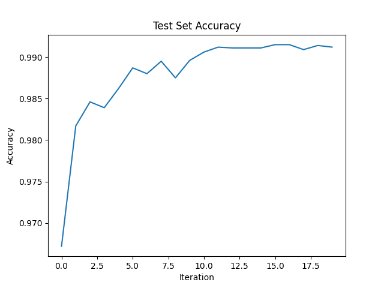
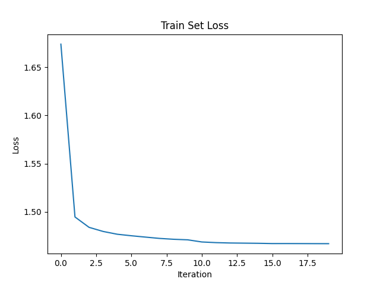
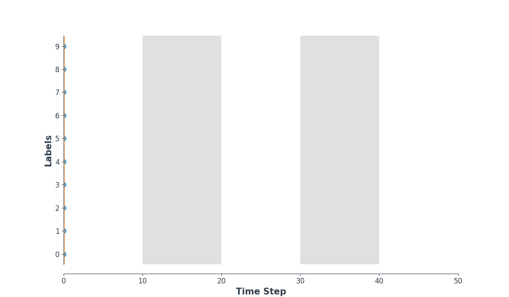
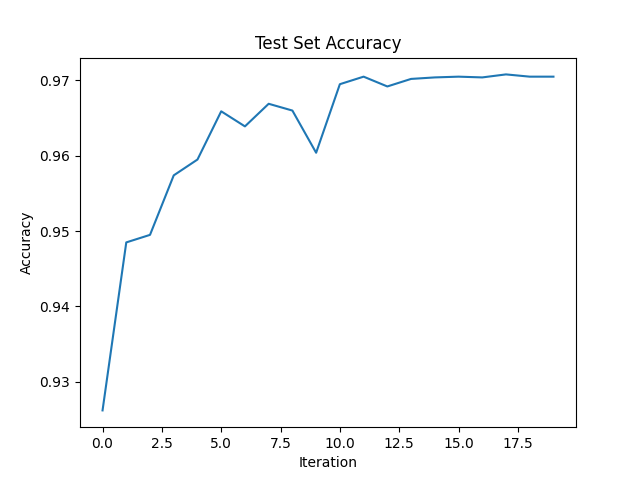
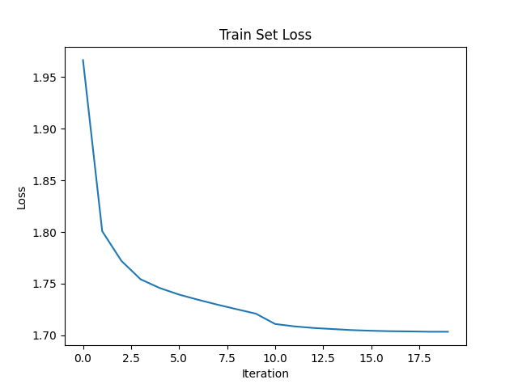
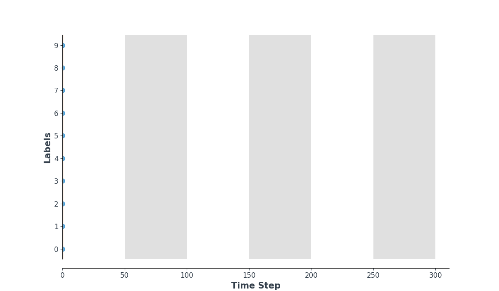
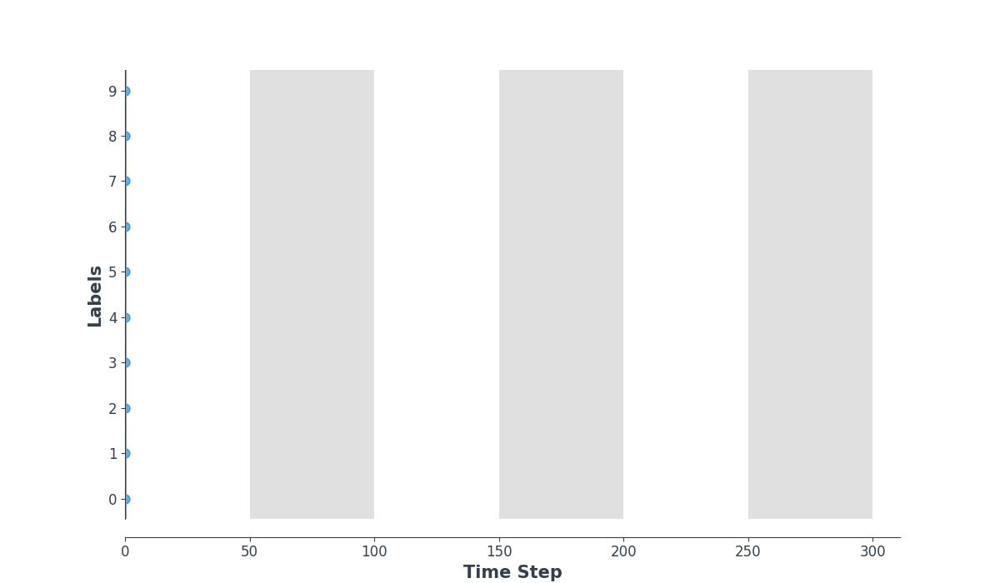
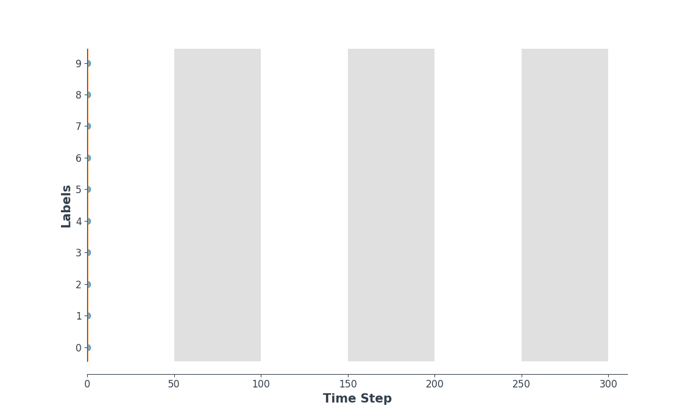

# SNN Image Classification

Homework 2 of AI3610.

## Installation

```bash
# 1. Create a conda virtual enviornment.
conda create -n snn python=3.9 -y
conda activate snn

# 2. Install PyTorch >= 1.10 according to your CUDA version. For example:
pip3 install torch torchvision torchaudio --extra-index-url https://download.pytorch.org/whl/cu113

# 3. Install the library
pip install -e .
```

## Instructions

The library is implemented with [hydra](https://hydra.cc/docs/intro/), [PyTorch](https://pytorch.org/) and [snnTorch](https://snntorch.readthedocs.io/en/stable/index.html).

The main script of training is `scripts/train.py` and the main library is under `snn_nmnist/` where `snn_nmnist/logger.py` contains some functions of logging and `snn_nmnist/utils.py` contains all necessary related util functions from model and dataloader building to result visualization, etc.

I support two input formats: static inputs and spike inputs. They are defined by the `data.spike` flag in [config](configs/default.yaml). Default is false.

By default, the model is trained for $20$ epoches on a single NVIDIA GeForce RTX 3090 GPU. Adam optimizer is applied with an initial learning rate of $1e-2$, and the learning rate will be reduced by $10$ after $10$ and $15$ iterations.

## Model

In this library, I implement a simple convolutional spiking neural network (CSNN) . The convolutional network architecture to be used is: `12C5-MP2-64C5-MP2-1024FC10`.

- `12C5` is a 5×5 convolutional kernel with 12 filters
- `MP2` is a 2×2 max-pooling function
- `1024FC10` is a fully-connected layer that maps 1,024 neurons to 10 outputs

The detailed implementation can be found [here](snn_nmnist/utils.py). (See the `build_model` function)

## Quick Start

The system is implemented with [hydra](https://hydra.cc/docs/intro/). The configuration can be easily figured out in cmd. I highly recommend users to run the script on a GPU.

```bash
# To use static data (default):
CUDA_VISIBLE_DEVICES=0 python scripts/train.py

# To use spike data:
CUDA_VISIBLE_DEVICES=0 python scripts/train.py exp_id=spike data.spike=true
```

All other flags can be found [here](configs/default.yaml).

## Results

The results and logs can be found in `exp/{exp_id}/` after running my script, which contains the checkpoints, logs and some visualization results.

For static data, I achieve a final test accuracy of  **99.12%**. The log file can be found [here](docs/static/training.log). For spike data, I achieve  a final test accuracy of **97.05%**. The log file can be found [here](docs/spike/training.log). You can reduce the `data.subset` parameter or raise the `train.num_epochs` parameter in configuration to obtain a better result.

### Static data

Training loss curve and testing accuracy curve are shown as below:

 



Some spike counter examples:

- **Target: 8**

  

- **Target: 0**

  

- **Target: 1**

  

- **Target: 1**

  

- **Target: 6**

  

### Spike data

Training loss curve and testing accuracy curve are shown as below:





Some spike counter examples:

- **Target: 6**

  

- **Target: 5**

  

- **Target: 3**

  

- **Target: 7**

  

- **Target: 9**

  

## Acknowledgement

I would like to thank the awesome [snnTorch](https://github.com/jeshraghian/snntorch) that I have referred to.

## References

```bibtex
@article{eshraghian2021training,
        title   =  {Training spiking neural networks using lessons from deep learning},
        author  =  {Eshraghian, Jason K and Ward, Max and Neftci, Emre and Wang, Xinxin
                    and Lenz, Gregor and Dwivedi, Girish and Bennamoun, Mohammed and
                   Jeong, Doo Seok and Lu, Wei D},
        journal = {arXiv preprint arXiv:2109.12894},
        year    = {2021}
}
```

